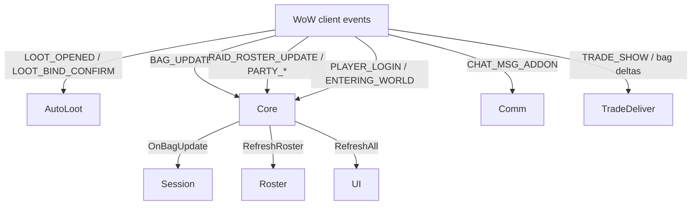
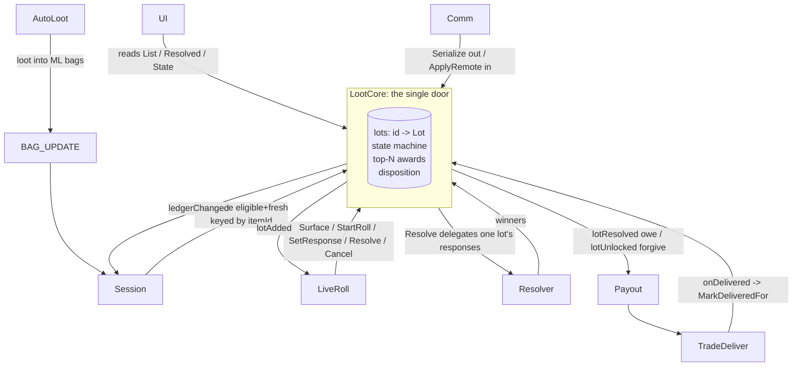

# WeirdLoot codebase flow

How the addon is wired now that `LootCore` is integrated: the core owns loot truth and
every other module is a consumer. Names and API are read from source, not guessed
(verified 2026-06-19, branch `feature/lootcore`).

---

## 1. Event entry points

Everything is event-driven through `Core.lua`, which owns the event frame and fans out
to the modules.



`BAG_UPDATE` is the single hinge: all loot enters the model only through the bag, on
purpose. AutoLoot never feeds the model directly. Only the ML reconciles bag reality
into the ledger; raiders mirror via the snapshot.

---

## 2. The core: one owner of loot truth

`LootCore` (`LootCore.lua`) is pure Lua, no WoW globals, loaded right after `Core.lua`.
Its entity is the **Lot**:

```
Lot = { id = "L:<seq>", itemId, state, count,
        responses = { playerKey = tier },   -- group roll, one per lot
        awards     = { ... },               -- per-copy disposition, frozen at resolve
        record }                            -- the rendered result row
```

- **Identity is the numeric `itemId`**, never the link or name (those vary by client
  locale). Two links that share an itemId (random-suffix variants) collapse to one lot.
- **The lot id `L:<seq>` is the canonical id everywhere**: roll id, projection
  `item.id`, response key, and wire id are all the same string.
- **Distribution is one roll, top-N winners.** The lot holds a single `responses` table;
  `Resolve` orders the winners and maps them onto per-copy `awards` underneath.

Lot lifecycle (`STATE`): `new` -> `idle` -> `pending` -> `rolling` -> `resolved`, with
`skipped` as a snooze that resurfaces next pass. Per-copy award disposition (`AWARD`):
`owed` (won by a non-ML player, awaiting delivery), `resolved` (self-win or no-winner,
ML already holds it), `delivered` (terminal, traded and recorded), `removed` (terminal,
left bags with no delivery reported).

---

## 3. The loot lifecycle today

Every module reaches the model through one door: a query, a command, or an event. No
module keeps its own copy of loot state.



The wiring, concretely:

| Edge | Code |
|------|------|
| bag -> core | `Session:OnBagUpdate` -> `Reconcile(ItemIdCounts(BuildTradeableEpicCounts()), fresh)` |
| core -> projections | `core:On("ledgerChanged")` -> `Session:RebuildLootProjections` (rebuilds `session.items`/`results`), refresh UI, ML auto-broadcasts snapshot |
| core -> live popups | `core:On("lotAdded")` -> `LiveRoll:OnLotAdded`; `ledgerChanged` -> `SyncPendingPopups` |
| resolve | `core:Resolve(id)` delegates to `Resolver:ResolveSessionItem(lot)` via `SetResolver`, freezes ordered winners onto awards, emits `lotResolved` |
| owe / forgive | `core:On("lotResolved")` -> `Payout:OnLotResolvedPayout` (Owe); `lotUnlocked` -> `OnLotUnlockedPayout` (Forgive) |
| delivery | `TradeDeliver` `onDelivered` -> `core:MarkDeliveredFor(player, itemId)` records the per-copy disposition |
| sync | `Comm:BroadcastSession` -> `core:Serialize`; receive -> `core:ApplyRemote` (carries itemId so each client localizes) |

`session.items` and `session.results` are **projections** rebuilt from the core on every
`ledgerChanged`, on both the ML (after Reconcile/Resolve) and raiders (after
ApplyRemote). One code path renders both; nobody mutates them as independent state.

---

## 4. Core API surface

| Group | Methods |
|-------|---------|
| reconcile | `Reconcile(eligible, freshLinks)` (ML only), `Reset` |
| lifecycle | `Surface(id)`, `Skip(id)`, `StartRoll(id)`, `Cancel(id)`, `Resolve(id)`, `Unlock(id)`, `UnlockAll()` |
| responses | `SetResponse(id, player, value)`, `GetResponse(id, player)` |
| delivery | `MarkDelivered(id, awardIndex, recipient, when)`, `MarkDeliveredFor(player, itemId, when)` |
| queries | `Get(id)`, `State(id)`, `IsResolved(id)`, `LiveCount(id)`, `Surfaceable()`, `List()`, `Resolved()`, `All()`, `Log()` |
| sync | `Serialize()`, `ApplyRemote(snapshot)` |
| wiring | `On(event, handler)`, `SetResolver(fn)`, `SetML(playerKey)`, `IsML(playerKey)` |
| events | `ledgerChanged`, `lotAdded`, `lotResolved`, `lotUnlocked`, `lotDelivered` |
| self-test | `RunSelfChecks(verbose)` |

Resolver still owns winner-picking (bracket -> named -> spec -> status -> roll, top-N by
count); the core only hands it one lot's responses. TradeDeliver still owns the trade
engine; the core only records the `MarkDeliveredFor` result. Roster/Config own roster +
rules; Util/ItemInfo stay utility modules.

---

## 5. Validation and known gaps

- **Out-of-game battery**: `tests/run.lua` (84 checks) loads the real addon into a mocked
  WoW env. Run `luajit tests/run.lua`. Currently 84 passed, 0 failed. Plus
  `LootCore.RunSelfChecks` (31 pure-core checks).
- **In-game**: not yet exercised; the frame/event wiring and trade engine run under UI
  the harness mocks.
- **Known race** (failing-by-design test "KNOWN RACE: ..."): if `BAG_UPDATE` reconciles a
  traded item as gone before TradeDeliver's trade-complete callback, the copy is recorded
  `removed`, not `delivered`. Tighten later.
- **Deferred from the upstream merge**: upstream's live-roll *popup* polish (class-gate in
  the popup, on-card roll lines, class-colored names, cross-client roll-value sync,
  sort-by-roll) was not carried into the LiveRoll collision; the core was kept as the
  foundation and these re-apply onto the lot model later. Gate-tokens-by-class is already
  live in the Loot tab and batch resolution.
</content>
</invoke>
